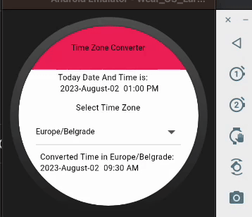

# Timezone Converter App

A Flutter app that allows users to convert time between different timezones. Users can select a timezone from a dropdown and input a custom date and time for conversion.

### Demo



## Features

- Select a timezone from a dropdown list.
- View the converted time based on the selected timezone.

## Article Link
(https://talent500.co/blog/building-wear-os-apps-with-flutter/)


## Getting Started

Follow these steps to get the app up and running on your local machine.

### Prerequisites

- Flutter SDK

### Installation

1. Clone the repository:

```bash
git clone https://github.com/ashut08/WatchTimeConverter
cd WatchTimeConverter
